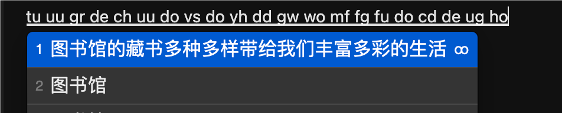
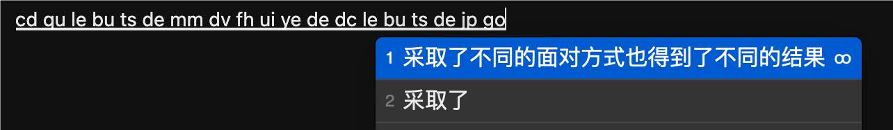
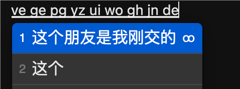
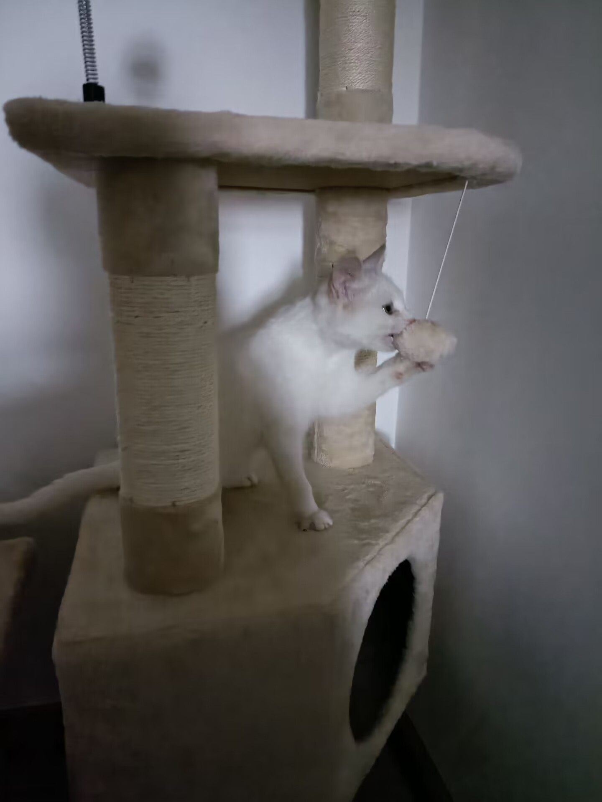

# 白霜拼音

白露凝烟绕玉堂，霜华浸月映回廊。拼将清景藏诗里，音绕庭轩岁月长。

原始配置和词库由[雾凇拼音](https://github.com/iDvel/rime-ice)的 [af2480b](https://github.com/iDvel/rime-ice/commit/af2480ba1b147a6a54c0c21e2997ef451c34e036) commit 修改而来。

雾凇词库主要的问题是字频和词频不太对，废词有点多，于是重新制作。[相关讨论](https://github.com/iDvel/rime-ice/issues/902)

主要维护词库、词频。在雾凇词库的基础上删除了不健康词汇，删除了大量冷僻词（频率==1 且分词器分不出的词），删除/调整了诸如“的吧”、“的了”这种不是词的词。手动大量修改了字频 词频。第一步是做了减法。

然后使用 745396750 字的高质量语料，进行分词，重新统计字频、词频，归一化，以达到更好的输入效果。全拼和双拼都可以使用。 

根据最新评测结果（生成时间: 2026-04-25 16:49:02 +08:00），[白霜拼音](https://github.com/gaboolic/rime-frost)在不使用模型和使用相同模型的评测上，均取得最佳效果，同时也超越商业输入法（关闭云拼音）。参见评测：

[查看rime各方案评测结果](https://github.com/gaboolic/rime-schema-compare/blob/main/report/latest.md) 

[查看其他windows输入法评测结果](https://github.com/gaboolic/rime-schema-compare/blob/main/report/other_latest.md)

评测的代码也是开源的，可复现。

现在推出了windows端独立输入法，可安装[墨奇输入法](https://github.com/gaboolic/moqi-im-windows)，自带白霜拼音作为默认方案。

### 使用方法

使用方法基本同雾凇拼音，微调了一些触发指令，加入了lua辅助码的支持。辅助码是可选项，按下`开启，不影响正常打字。
默认方案是全拼，可以切换输入方案，也支持自然码双拼、小鹤双拼、微软双拼、搜狗双拼等双拼方案。

- 符号 /fh 更多符号详见`https://github.com/gaboolic/rime-frost/blob/master/symbols_v.yaml`
- 带调韵母 /a /e /u 等
- 日期与时间 rq sj xq dt ts
- 开启辅助码 ` [墨奇辅助码拆分说明](https://moqiyinxing.chunqiujinjing.com/index/mo-qi-yin-xing-shuo-ming/fu-zhu-ma-shuo-ming/mo-qi-ma-chai-fen-shuo-ming)
- 部件拆字反查 uU
- unicode字符 U
- 数字金额大写 R
- 农历 N
- 计算器 V

### 如何安装&配置文件路径

#### 手动下载安装

下载本仓库的压缩包 Code - Download ZIP（或者下载[releases](https://github.com/gaboolic/rime-frost/releases)最新的 source-code.zip），解压到如下路径即可

- Windows: 
  - 小狼毫：%APPDATA%\Roming\Rime （可以在右下角小狼毫输入法右键打开菜单选用户文件夹）复制完之后，去输入法设定里选择白霜拼音，然后重新部署
  - 安装[墨奇输入法](https://github.com/gaboolic/moqi-im-windows)的自带方案。Rime配置文件夹在：%APPDATA%\Roming\Moqi\Rime （可以在右下角输入法右键打开菜单选用户文件夹）
- Mac
  - [鼠须管](https://github.com/rime/squirrel)路径为 `~/Library/Rime`
  - [fcitx5-Mac 版](https://github.com/fcitx-contrib/fcitx5-macos)路径为 `~/.local/share/fcitx5/rime`
- Linux
  - [fcitx5-rime](https://github.com/fcitx/fcitx5-rime)路径为 `~/.local/share/fcitx5/rime`
  - fcitx5 flatpak 版的路径 `~/.var/app/org.fcitx.Fcitx5/data/fcitx5/rime`
  - [ibus-rime](https://github.com/rime/ibus-rime)路径为 `~/.config/ibus/rime`
- Android
  - [fcitx5-安卓版](https://github.com/fcitx5-android/fcitx5-android)路径为 `/Android/data/org.fcitx.fcitx5.android/files/data/rime`
  - [同文](https://github.com/osfans/trime)路径为 `/rime`
  - [雨燕](https://github.com/gurecn/YuyanIme) 已内置白霜词库词频，直接安装使用即可
- iOS 
  - [仓输入法](https://github.com/imfuxiao/Hamster) 目前已内置，也可以通过【输入方案设置 - 右上角加号 - 方案下载 - 覆盖并部署】来更新白霜拼音。
  - [元书输入法] 白霜拼音下载链接：https://github.com/gaboolic/rime-frost/releases/download/nightly/rime-frost-schemas.zip


#### 通过 Git 安装

**首次安装：**

根据用户使用的系统、安装的软件不同，先cd到对应的配置文件的父级目录(例如Windows为`%APPDATA%`、mac鼠须管为`~/Library/`)，然后执行以下命令：

`git clone --depth 1 https://github.com/gaboolic/rime-frost Rime`

**后续更新：**

在 Rime 文件夹执行 `git pull` 即可。

- Mac: `cd ~/Library/Rime && git pull`
- Windows: `cd "$env:APPDATA\Rime" && git pull`
- 其他系统以此类推

#### 通过 东风破 安装

选择配方（others/recipes/*.recipe.yaml）来进行安装或更新：

- ℞ 安装或更新全部文件 执行bash rime-install gaboolic/rime-frost:others/recipes/full

### 无智能模型时的输入效果











### 不同方案整句效果对比

可以运行 <https://github.com/gaboolic/rime-schema-compare> 来对比各个拼音方案

[查看最新评测结果](https://github.com/gaboolic/rime-schema-compare/blob/main/report/latest.md)

###  语言模型

语言模型说明见 [rime-octagram-data.txt](others/语言模型相关/rime-octagram-data.txt)
修改rime_frost.custom.yaml，添加：
```
patch:
  grammar:
    language: wanxiang-lts-zh-hans
    non_collocation_penalty: -4
    collocation_max_length: 5
    collocation_min_length: 2
    collocation_penalty: -14
  translator/contextual_suggestions: true
  translator/max_homophones: 4
  translator/max_homographs: 2
```

### 鸣谢

雾凇词库 <https://github.com/iDvel/rime-ice> 白霜词库的初始词库、绝大部分配置来自雾凇词库

结巴中文分词 <https://github.com/fxsjy/jieba>

汉字转拼音(pypinyin) <https://github.com/mozillazg/python-pinyin>

MNBVC 超大规模中文语料集 <https://github.com/esbatmop/MNBVC> 目前已有 33TB 数据量

kenlm <https://github.com/kpu/kenlm> 官网<https://kheafield.com/code/kenlm/>

kenlm 教程、python 调用 <https://github.com/mattzheng/py-kenlm-model>

吉祥物(于2024-10-12捡来)：



### 友情链接

使用白霜词库的方案

墨奇输入法windows版 <https://github.com/gaboolic/moqi-im-windows>

墨奇音形 <https://github.com/gaboolic/rime-shuangpin-fuzhuma>

墨奇五笔整句 <https://github.com/gaboolic/rime-wubi-sentence>

薄荷拼音 <https://github.com/Mintimate/oh-my-rime>

雨燕输入法 <https://github.com/gurecn/YuyanIme> 一个开箱即用的安卓输入法 内置白霜词库

### Star History

[](https://star-history.com/#gaboolic/rime-frost&Date)
